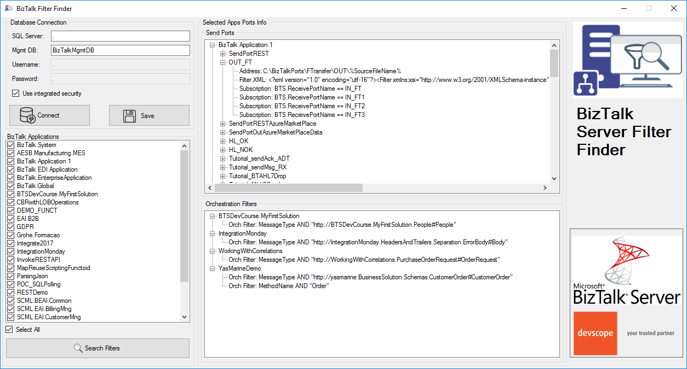

# BizTalk Filter Finder Tool
Have you ever found yourself in a position where you needed to understand how a particular BizTalk solution works? And to make matters worse, the majority of the solution is implemented based on content-based routing?

If you have found yourself managing solutions, that majority is implemented with content-based routing, which is usually associated with not using orchestrations. You know that is not easy to understand the solution:
* What ports are subscribing to the messages?
  * In which conditions?
  * In which application?
But that’s not all. Even worse if you have orchestrations using filters based on the content/context of the message in the activation.
This kind of analyze is hard because BizTalk Server Administration Console doesn’t provide an easy way out-of-the-box for you to see these subscriptions for example in a visual diagram or in a central place.

And out-of-the-box with the product, the only solution is to query the subscription from the BizTalk Server Administration Console. But then you need to go one by one (subscriptions) and see what the filters are.
In conclusion this is a hard and time-consuming task.

# Description

“BizTalk Filter Finder Tool” is a simple tool that aims to simplify the process for better understand and maintain solutions based on content-based routing. By allowing you to have a quick overview of all the artifacts, send ports or orchestrations that have filters associated.

This tool will extend default BizTalk Server capabilities transforming this tedious and sometimes complicate analyze a little simple, easy and fast.

# About US
**Sandro Pereira** | [DevScope](http://www.devscope.net/) | MVP & MCTS BizTalk Server 2010 | [https://blog.sandro-pereira.com/](https://blog.sandro-pereira.com/) | [@sandro_asp](https://twitter.com/sandro_asp)

**Pedro Almeida** | [DevScope](http://www.devscope.net/) | Integration Developer 
